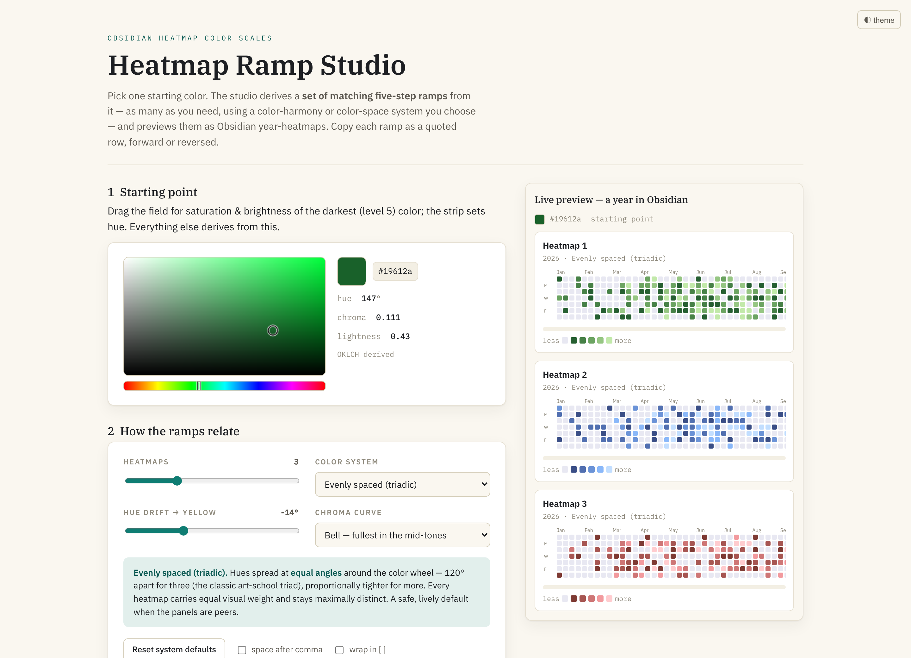
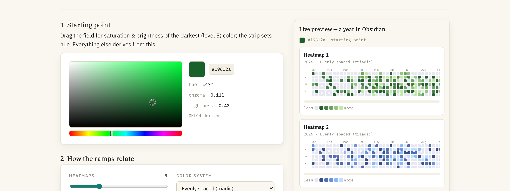
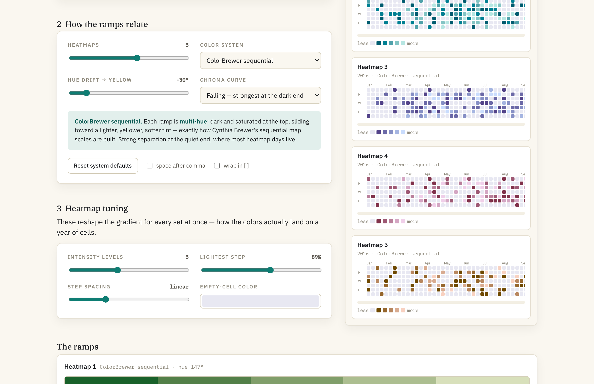
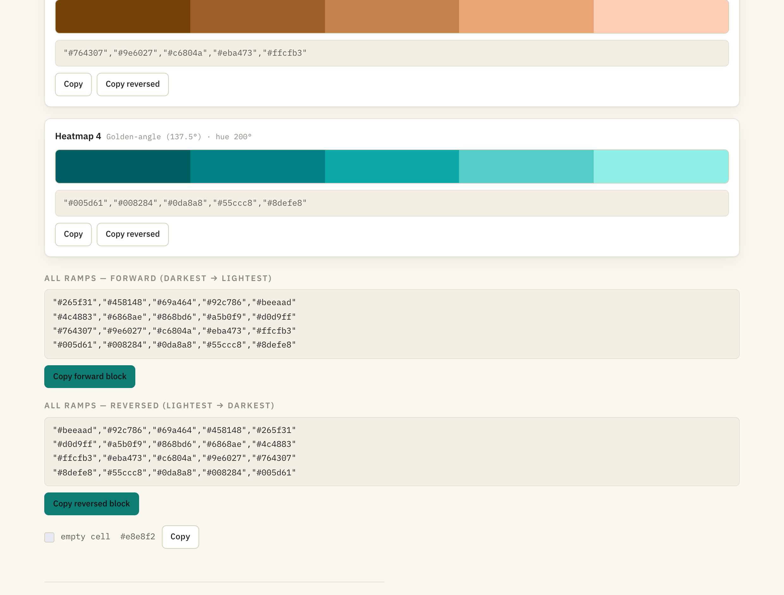
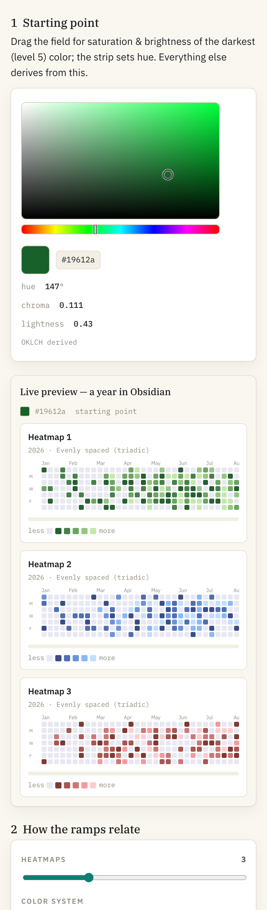

# Heatmap Ramp Studio

Build sets of **matching multi-step color ramps** — the kind GitHub and the
Obsidian heatmap plugins use for contribution-style year grids — starting from a
single color, in one self-contained HTML file.

Pick **one** starting color. The studio derives as many matching ramps as you
ask for, using a color-harmony or color-space system you choose, and previews
each one as an Obsidian year-heatmap. Copy any ramp as a quoted row, forward or
reversed.

## Use it

Open [`heatmap-color-picker.html`](heatmap-color-picker.html) in any browser.
No build step, no server, no dependencies — it runs straight from `file://`.

## 1 · Pick a starting color

An HSV field plus a hue strip. The color you pick becomes the **darkest**
(most-active) step of the first ramp; its OKLCH lightness, chroma and hue are
read off and everything else is derived from them. Drag, or focus it and use the
arrow keys; click the hex to copy it.

## 2 · Choose how the ramps relate

A **Heatmaps** slider (1–8) sets how many ramps to generate. A **color system**
decides how their hues relate — each option carries a short explanation and each
one scales to any count:

| System | Idea |
| --- | --- |
| Evenly spaced (triadic) | Equal angles around the wheel |
| Analogous | Neighboring hues in a narrow arc |
| Split-complementary | Base hue + a fan around its opposite |
| Tetradic | Corners of a rectangle on the wheel |
| Golden-angle (137.5°) | Sunflower spacing — evenest for any count |
| Perceptually even (OKLCH) | Equal *perceptual* lightness steps |
| ColorBrewer sequential | Multi-hue, dark→light with a yellow drift |
| Cubehelix | Monotonic lightness, spiralling hue |
| Material tonal | Fixed hue, chroma peaking mid-tones |
| HSL "classic web" | Constant hue/saturation, equal HSL steps |
| Warm / cool split | Warm anchor, cool anchor, neutral bridge |
| Monochromatic | One hue, muted → vivid |

Two more shaping controls — **hue drift toward yellow** and a **chroma curve** —
plus a per-system reset.

## 3 · Tune the gradient for the heatmap

Applied to every ramp at once: **intensity levels** (3–8), **lightest step**
lightness, **step spacing** (a gamma on where the steps land — pack detail into
the quiet or the busy end), and the **empty-cell color**.

## 4 · Copy it out

Every ramp as a quoted, comma-separated row — `"#265f31","#458148",…` —
forward or reversed, per ramp or as combined "all ramps" blocks in both
directions, plus the empty-cell color. Optional `, ` spacing and `[ ]` wrapping.

## Works anywhere

- Two-pane on desktop, single column on mobile with the preview pinned under the
  picker.
- Light and dark themes, following the OS and toggleable.
- All color math (OKLCH ⇄ sRGB with chroma-reduction gamut clipping, HSV, HSL,
  cubehelix) is implemented inline — nothing is loaded or uploaded.

## License

[MIT](LICENSE) © 2026 Florian Lohse

See [CHANGELOG.md](CHANGELOG.md) for release history.
